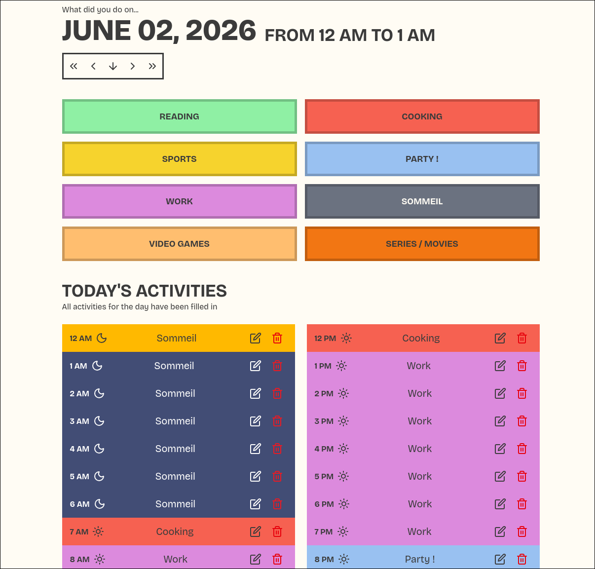
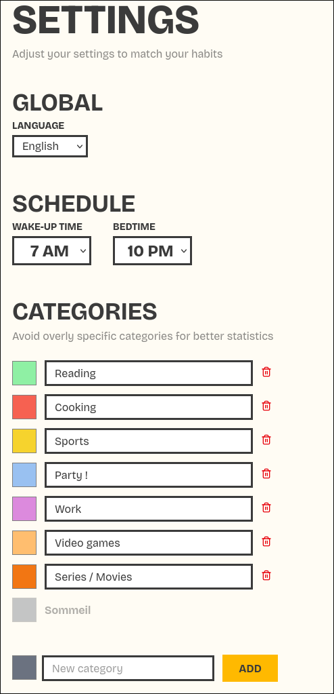

# Time Tracker

Time tracker is a very simple app to track how you spend your hours during the day developed with Ruby On Rails.

## Who thought you'd be your own big brother?

Wasn't it your dream to be able to track every hour of your life and extract statistics out of it? Well now it is, and `Time Tracker` makes it very easy!

## Features

### Track your time spent during the day

Click on some buttons - _badadim-badaboum_ - your time is tracked.

### Use the calendar view to get an overview

Know at a glance which day is fully completed or not. It took me some time, but I also added the view Excel time-trackers love, you know: **the one with the colored cells**.

### Setup your preferences to streamline the process

Settings reduced to the essential because who needs more? Actually, if you need more let me know by opening an issue ;)

### Desktop first but mobile friendly

As a huge nerd, my time is mostly spent in front of my computer, so the main layout was obviously designed for that viewport. At the moment the layout is responsive to make the app usable on mobile, but I don't think it's ideal. In the future I'll consider developing some native iOS / Android apps.

## Privacy

User connection is made using a magic link (it sends the user a code via email, and the connection is then stored in the user session). No info other than your email is stored in the database.

### Even more privacy

If you don't want your email to be stored in the database you can use any kind of alias to connect to the app as long as you're able to get the emails that are sent to that address.

[More details about email aliases](https://proton.me/blog/what-is-email-alias)

## Warning about tracking

There are no cookies or other user profiling service. I made this app for me and figured some other people could benefit from it or would enjoy using it.

I only added [Plausible](https://plausible.io/) which is a privacy-friendly analytics service that I host on my own hardware. I added that because I find it cool to see where traffic comes from, that's all.

### Disable tracking the hard way

If it bothers you, it can be easily deactivated using an ad blocker like uBlock Origin or any equivalent. If it bothers more people, I'll consider adding an option directly in the app settings.

## Contributing

See [contributing guideline](CONTRIBUTING.md)

## Philosophy around that app

Please note that this app is deployed on a modest local home-server in a KVM on Proxmox. Performance will not be great, but should be sufficient to click on some buttons.

Also be warned, as this goes public it'll be prone to DDOS and any other kind of attack. As I have a real job and a life, I won't make this a priority, and if I don't notice it or someone tells me via email, the server could stay down for a while.

Once you're aware of that you can use that app as you like, for fun or trying to break it!

In the future, if some more users enjoy it I'll make it more robust for the sake of everyone.

## Bug report or feature request

If you encounter a bug or have a feature request, [send me an email](mailto:timetracker@dotsncircles.com), create an issue, or start a discussion thread. Please be as descriptive as possible by providing the most information you can, and ideally an example or a way to reproduce it.

## Code of conduct

Before contributing to this repository, please read the [code of conduct](code_of_conduct.md)
